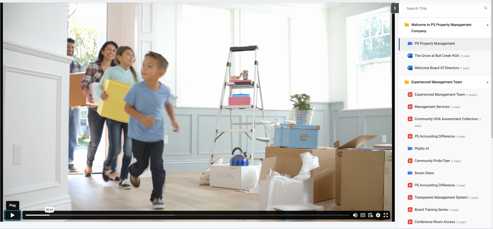

# HOA AI Community Nexus

Welcome to your Lovable project. This repository contains a Vite + React + TypeScript application configured to work with Supabase.

## Project info

**URL**: https://lovable.dev/projects/a73d32bc-6ef6-4db0-a286-f45bb60ffc4a

## Prerequisites

- **Node.js** (version 18 or higher)
- **npm**
- [Supabase CLI](https://supabase.com/docs/guides/cli) (required if you want to run the Supabase stack locally)

## Getting Started

1. **Clone the repository**
   ```bash
   git clone <YOUR_GIT_URL>
   cd <YOUR_PROJECT_NAME>
   ```
2. **Install dependencies**
   ```bash
   npm install
   ```
3. **Create an environment file**
   - Copy `.env.example` to `.env` and fill in at least the following values:
     - `VITE_SUPABASE_URL`
     - `VITE_SUPABASE_ANON_KEY`
    - `VITE_OPENAI_API_KEY` *(optional)*
    - `OPENAI_WHISPER_API_KEY` *(for audio transcription)*
     - `VITE_STRIPE_PUBLISHABLE_KEY` *(optional)*
4. **Start the development server**
   ```bash
   npm run dev
   ```
5. **Build for production**
   ```bash
   npm run build
   ```
6. **Lint and test**
   Before running lint or test scripts, make sure all dependencies are installed.
   ```bash
   npm install
   npm run lint
   npm test
   ```


## Supabase Configuration

The project contains a `supabase` directory with functions and migrations. If you wish to run these locally, install the Supabase CLI and run:

```bash
supabase start
```

This will launch a local Supabase instance using the settings defined in `supabase/config.toml`.

### API Endpoints

Backend logic is implemented with **Supabase Edge Functions** located in the `supabase/functions` directory. These functions replace traditional API routes used in some Vite projects. For example, the voice assistant feature calls the `transcribe-audio` function. From the frontend you can invoke them using `supabase.functions.invoke('function-name')`.

## How can I edit this code?

There are several ways of editing your application.

### Use Lovable

Simply visit the [Lovable Project](https://lovable.dev/projects/a73d32bc-6ef6-4db0-a286-f45bb60ffc4a) and start prompting.

Changes made via Lovable will be committed automatically to this repo.

### Use your preferred IDE

If you want to work locally using your own IDE, you can clone this repo and push changes. Pushed changes will also be reflected in Lovable.

The only requirement is having Node.js & npm installed - [install with nvm](https://github.com/nvm-sh/nvm#installing-and-updating)

Follow these steps:

```sh
# Step 1: Clone the repository using the project's Git URL.
git clone <YOUR_GIT_URL>

# Step 2: Navigate to the project directory.
cd <YOUR_PROJECT_NAME>

# Step 3: Install the necessary dependencies.
npm i

# Step 4: Start the development server with auto-reloading and an instant preview.
npm run dev
```

### Edit a file directly in GitHub

- Navigate to the desired file(s).
- Click the "Edit" button (pencil icon) at the top right of the file view.
- Make your changes and commit the changes.

### Use GitHub Codespaces

- Navigate to the main page of your repository.
- Click on the "Code" button (green button) near the top right.
- Select the "Codespaces" tab.
- Click on "New codespace" to launch a new Codespace environment.
- Edit files directly within the Codespace and commit and push your changes once you're done.

## What technologies are used for this project?

This project is built with:

- Vite
- TypeScript
- React
- shadcn-ui
- Tailwind CSS

## Configuration

Create a `.env` file using `.env.example` as a template and provide your Supabase credentials:

```sh
cp .env.example .env
```

Set `VITE_SUPABASE_URL` and `VITE_SUPABASE_ANON_KEY` in `.env`. The app reads these values via `import.meta.env` when creating the Supabase client.

## Linting

`npm run lint` currently fails because the ESLint rules are very strict. Make sure to run `npm run setup` before running any lint or test commands.

## How can I deploy this project?

Simply open [Lovable](https://lovable.dev/projects/a73d32bc-6ef6-4db0-a286-f45bb60ffc4a) and click on Share -> Publish.

## Can I connect a custom domain to my Lovable project?

Yes, it is!

To connect a domain, navigate to Project > Settings > Domains and click Connect Domain.

Read more here: [Setting up a custom domain](https://docs.lovable.dev/tips-tricks/custom-domain#step-by-step-guide)

## UI Preview

Below is a screenshot of the dashboard page.



## Changelog

- Removed `bun.lockb` because the project does not currently support the Bun runtime. Use Node.js and npm for dependency management.
